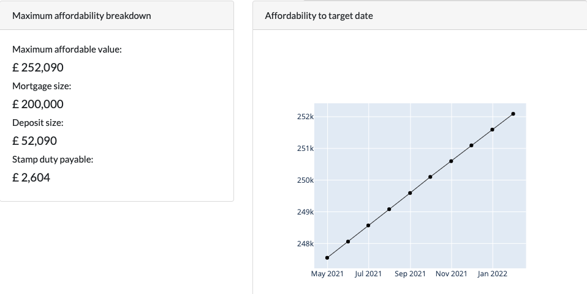
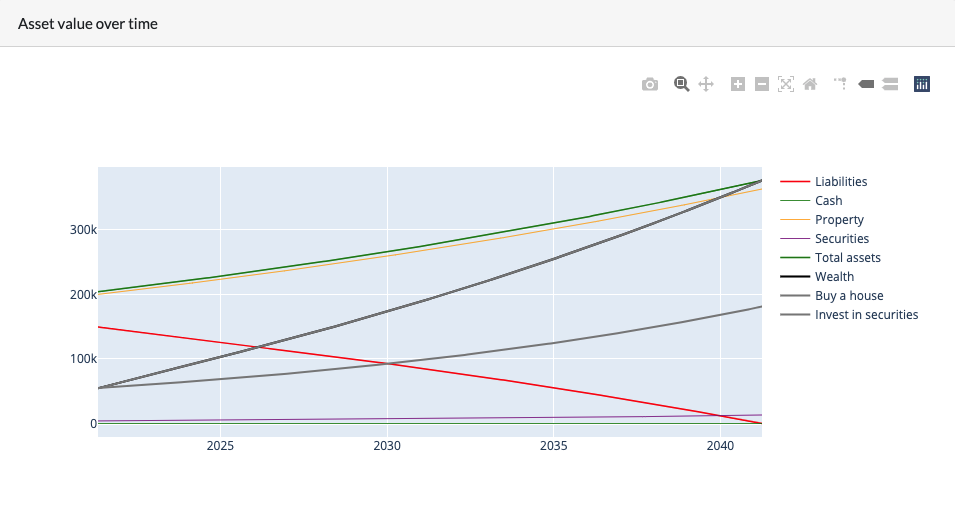

## Pland

Pland is a project developed to help you budget appropriately when planning to purchase a home. It helps you:

- Understand what you can afford
- Choose a mortgage that is right for you
- Compare the impact of buying a house vs. investing elsewhere on your wealth

You can view the app [here](https://pland-bzipk2phsa-ew.a.run.app/). Open the app and follow the tutorial below on how to use it.

### Tutorial

The three tabs at the top of the page should be completed sequentially: budget, mortgage and asset allocation.

### Budget tab

The budget tab helps you understand the highest house price you are likely to be able to afford.

To use the page, fill in your details in the "Savings" and "Other info" cards. The LTI you are able to borrow will vary according to your personal circumstances, but something in the range of 4 - 4.5 is common.

Once complete the 'Maximum affordability breakdown' card will display the likely maximum affordable value as well as the breakdown between mortgage, deposit and stamp duty. The chart in the bottom right shows how this varies up to your preferred purchase date.



Note: stamp duty payable is taken off the deposit size.

### Mortgage tab

Now click through to the mortgage tab. The mortgage size and purchase price will automatically be set to the highest possible affordable value, based on the information provided in the Budget tab.

You can alter these values, as well as the mortgage rates and terms until you find a monthly repayment profile that feels appropriate.

The tool automatically calculates the total amount of interest payable over the term of the mortgage. Hopefully this can make clear the advantages of mortgages with shorter terms!

Once you are happy with the mortgage created, the 'Save mortgage' button should be clicked. This will save the mortgage details for comparisons on the asset allocation page.

If you like, create several mortgages at once as you will be able to compare these against one another on the asset allocation page.

### Asset allocation

The asset allocation tab can be used to compare different potential investment allocations against one another to see what the potential impact on total wealth is likely to be.

This can help you to work out if buying a house makes sense from a financial perspective compared to investing your deposit money elsewhere.

To use the page, first you need to load in a previously saved mortgage. The mortgage listed as £0 can be used to generate scenarios with no house purchase.

Once the mortgage has been selected, the stamp duty payable will automatically complete and you can choose how to allocate any remaining savings using the cash and securities sliders.

You can then fill out expectations for house price, cash and securities yields. This can be helpful if you think that house price growth and securities price growth may be different.

Additional saveable income and rental income can be input alongside any expected monthly expenditures. Any excess savings will automatically be invested into securities. The app does not support scenarios where monthly expenditures exceed monthly incomes.

Once you are happy with a scenario, enter a name for the scenario and click "Save Scenario". This will preserve the wealth line on the 'Asset value over time' chart.

You can then generate as many new scenarios as you like, and compare how the different strategies are likely to affect your overall wealth over time.



### Using the code

To set up poetry virtual environment run:

```console
pip install poetry
poetry install
```

To run the app locally open a poetry shell and run:

```console
python index.py
```

or simply:

```console
poetry run python index.py
```
